<!-- .slide: data-background="images/network-background.jpg" class="background" -->

<h2>The Institute for Ethical AI & ML</h2>
<h3>The state of Production ML in 2019</h3>
<p>
  <br />
  <br />
    Alejandro Saucedo | <a href="">a@ethical.institute</a><br/><br/>
    Twitter: <a href="http://twitter.com/AxSaucedo">@AxSaucedo</a><br/>
  <br />
</p>

[NEXT]
<!-- .slide: data-background="images/network-background.jpg" class="background" -->

<h2>The Institute for Ethical AI & ML</h2>

<h4>The state of Production ML in 2019</h4>

<table class="bio-table">
  <tr>
    <td style="float: left">
        <br>
        
        <br>
        <font style="font-weight: bold; color: white">Alejandro Saucedo</font>
        <br>
        Twitter: <a href="https://twitter.com/axsaucedo">@AxSaucedo</a>
    </td>
    <td style="float: left; color: white; font-size: 0.7em;">

        <br>
        Chief Scientist
        <br>
        <a style="color: cyan" href="http://e-x.io">The Institute for Ethical AI & ML</a
        <br>
        <br>
        <br>
        Engineering Director
        <br>
        <a style="color: cyan" href="#">Seldon Technologies</a>
        <br>
        <br>
        <hr>
        <br>
        Head of Solutions Eng. & Sci.
        <br>
        <a style="color: cyan" href="http://eigentech.com">Eigen Technologies</a>
        <br>
        <br>
        Software Engineer
        <br>
        <a style="color: cyan" href="#">Bloomberg LP.</a>

    </td>
  </tr>
  <tr>
  </tr>
</table>

[NEXT]
<!-- .slide: data-background="images/partistat.png" class="background smallquote" style="color: white" -->

## The Institute for Ethical AI & Machine Learning

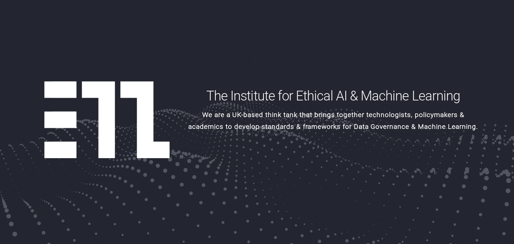

[NEXT]
<!-- .slide: data-background="images/partistat.png" class="background smallquote" style="color: white" -->


## Open Source Machine Learning Deployment and Orchestration


#### <a href="https://seldon.io">seldon.io</a>


[NEXT]
<!-- .slide: data-background="images/parti.png" class="background smallquote" style="color: white" -->

## Small data science projects
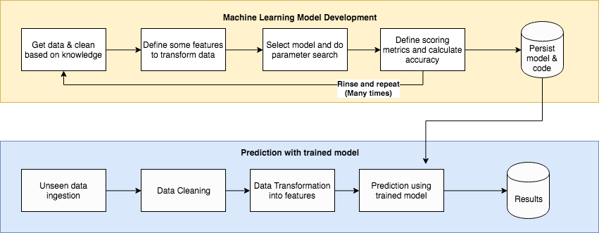
<!-- .element: style="background-color: white !important" -->

### Works relatively well


[NEXT]
<!-- .slide: data-background="images/parti.png" class="background smallquote" style="color: white" -->

# However
As our data science requirements grow...
## We face new issues

[NEXT]
<!-- .slide: data-background="images/parti.png" class="background smallquote" style="color: white" -->
#### Increasing complexity in flow of data


[NEXT]
<!-- .slide: data-background="images/parti.png" class="background smallquote" style="color: white" -->
#### Each data scientist has their own set of tools

<div class="left-col">
    <ul>
        <li>Some ♥ Tensorflow</li>
        <li>Some ♥ R</li>
        <li>Some ♥ Spark</li>
    </ul>
</div>
<div class="right-col">

</div>

<br style="clear:both">
### Some ♥ all of them


[NEXT]
<!-- .slide: data-background="images/parti.png" class="background smallquote" style="color: white" -->

#### Serving models becomes increasinly harder


[NEXT]
<!-- .slide: data-background="images/parti.png" class="background smallquote" style="color: white" -->
#### When stuff goes wrong it's hard to trace back


[NEXT]
<!-- .slide: data-background="images/partistat.png" class="background smallquote" style="color: white" -->

### As your technical functions grow...


[NEXT]
<!-- .slide: data-background="images/partistat.png" class="background smallquote" style="color: white" -->

### So should your infrastructure


[NEXT]
<!-- .slide: data-background="images/parti.png" class="background smallquote" style="color: white" -->
## It's challenging
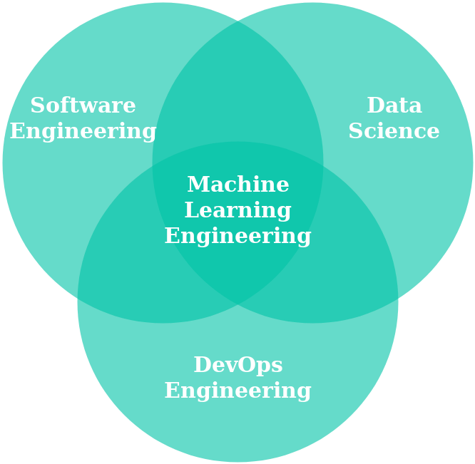


[NEXT]
<!-- .slide: data-background="images/partistat.png" class="background smallquote" style="color: white" -->

## We've mapped the ecosystem


||||
|-|-|-|
|[🔍 Explainability](https://github.com/EthicalML/awesome-machine-learning-operations#1-explaining-black-box-models-and-datasets) |[🔏 Privacy](https://github.com/EthicalML/awesome-machine-learning-operations#2-privacy-preserving-machine-learning) | [📜 Versioning](https://github.com/EthicalML/awesome-machine-learning-operations#3-model-and-data-versioning)|
|[🏁 Orchestration](https://github.com/EthicalML/awesome-machine-learning-operations#4-model-deployment-and-orchestration-frameworks)|[🌀 FeaturEng](https://github.com/EthicalML/awesome-machine-learning-operations#5-feature-engineering-automation)|[🤖 AutoML](https://github.com/EthicalML/awesome-machine-learning-operations#6-neural-architecture-search)|
| [📓 Notebooks](https://github.com/EthicalML/awesome-machine-learning-operations#7-data-science-notebook-frameworks) | [📊 Visualisation](https://github.com/EthicalML/awesome-machine-learning-operations#8-industrial-strength-visualisation-libraries) | [🔠 NLP](https://github.com/EthicalML/awesome-machine-learning-operations#9-industrial-strength-nlp) |
| [🧵 ETL](https://github.com/EthicalML/awesome-machine-learning-operations#10-data-pipeline-etl-frameworks) | [🗞️ Storage](https://github.com/EthicalML/awesome-machine-learning-operations#11-data-storage-optimisation) | [📡 FaaS](https://github.com/EthicalML/awesome-machine-learning-operations#12-function-as-a-service-frameworks) |
| [🗺️ Computation](https://github.com/EthicalML/awesome-machine-learning-operations#13-computation-load-distribution-frameworks) | [📥 Serialisation](https://github.com/EthicalML/awesome-machine-learning-operations#14-model-serialisation-formats) | [🎁 Compiler](https://github.com/EthicalML/awesome-machine-learning-operations#15-compiler-optimisation-frameworks)  |
| [💸 CommercialML](https://github.com/EthicalML/awesome-machine-learning-operations#16-commercial-data-science-platforms) | [💰 CommercialETL](https://github.com/EthicalML/awesome-machine-learning-operations#17-commercial-etl-platforms)| |
<br>

### https://bit.ly/awesome-mlops


[NEXT]
<!-- .slide: data-background="images/partistat.png" class="background smallquote" style="color: white" -->

## Principles today
<br>

<div class="left-col" style="width: 40%; padding-top: 25px">
<ul>
    <li>Orchestration</li>
    <li>Explainability</li>
    <li>Reproducibility</li>
</ul>
</div>

<div class="right-col" style="width: 60%">

</div>

[NEXT SECTION]
<!-- .slide: data-background="images/partistat.png" class="background smallquote" style="color: white" -->

# 2.1 Model Orchestration


### Training & serving at scale


[NEXT]
<!-- .slide: data-background="images/partistat.png" class="background smallquote" style="color: white" -->

## Computational Resource allocation

Services with different computational requirements

With often complex computational graphs

We need to be able to allocate the right resources

<br>
### This is a hard problem


[NEXT]
<!-- .slide: data-background="images/partistat.png" class="background smallquote" style="color: white" -->

## Adding Governance/Compliance

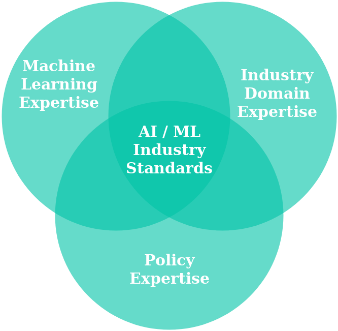


[NEXT]
<!-- .slide: data-background="images/partistat.png" class="background smallquote" style="color: white" -->

## Standardisation of metrics

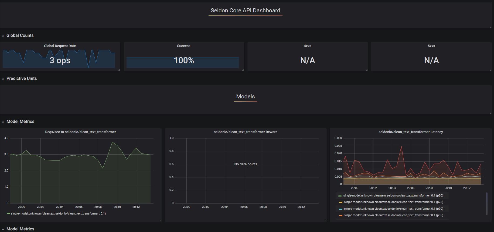


[NEXT]
<!-- .slide: data-background="images/partistat.png" class="background smallquote" style="color: white" -->

## Standardisation of errors

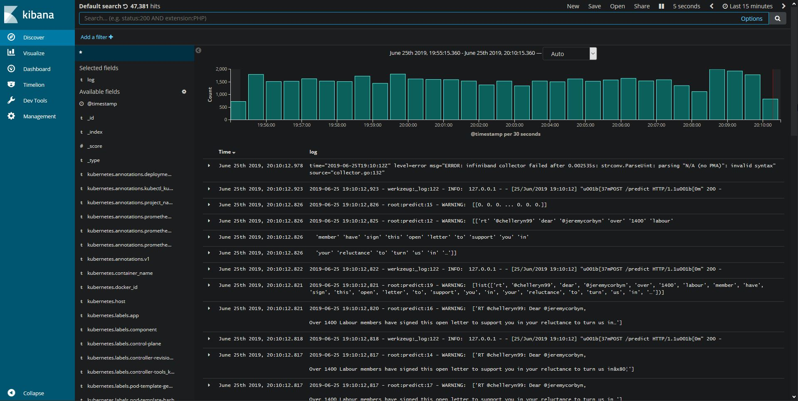

[NEXT]
<!-- .slide: data-background="images/partistat.png" class="background smallquote" style="color: white" -->

## Complex Deployment Strategies


[NEXT]
<!-- .slide: data-background="images/partistat.png" class="background smallquote" style="color: white" -->

## GitOps Strategies for ML


[NEXT]
<!-- .slide: data-background="images/partistat.png" class="background smallquote" style="color: white" -->

## Basic Example:

Wrapping an [income classifier Python model](http://localhost:8888/notebooks/alibi_anchor_tabular_seldon_deployment.ipynb)

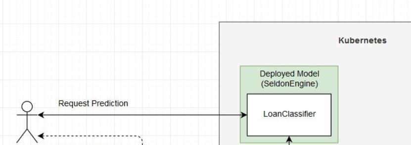


[NEXT]
<!-- .slide: data-background="images/partistat.png" class="background smallquote" style="color: white" -->

## Hands on example using:


#### Seldon core is an OSS library for  machine learning orchestration and monitoring in production


[NEXT]
<!-- .slide: data-background="images/partistat.png" class="background smallquote" style="color: white" -->

## Example:

PyTorch Hub Deployment: https://bit.ly/pytorchseldon

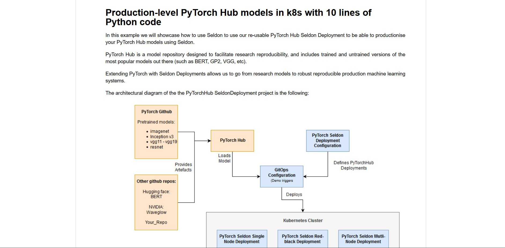


[NEXT]
<!-- .slide: data-background="images/partistat.png" class="background smallquote" style="color: white" -->

## Other libraries to watch

[NEXT]
<!-- .slide: data-background="images/partistat.png" class="background smallquote" style="color: white" -->

## MLeap Serving

Diving one level deeper into serialization of models

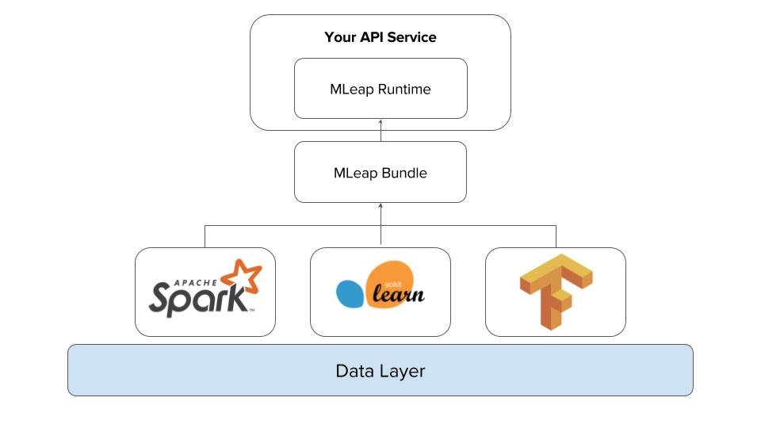


[NEXT]
<!-- .slide: data-background="images/partistat.png" class="background smallquote" style="color: white" -->
## DeepDetect

Unifying multiple external machine learning libraries on a single API


#### <a href="https://www.deepdetect.com/">www.deepdetect.com/</a>


[NEXT SECTION]
<!-- .slide: data-background="images/partistat.png" class="background smallquote" style="color: white" -->
# 2.2 Explainability
Tackling "black box model" situations


[NEXT]
<!-- .slide: data-background="images/partistat.png" class="background smallquote" style="color: white" -->
## Going beyond the algorithms 
Explainability through tools, process and domain expertise.


[Our talk on <a href="https://www.youtube.com/watch?v=GZpfBhQJ0H4">Explainability of Tensorflow Models</a>]


[NEXT]
<!-- .slide: data-background="images/partistat.png" class="background smallquote" style="color: white" -->

## Data assessment

<div class="left-col">
<br>
<ul>
    <li>Class imbalances</li>
    <li>Protected features</li>
    <li>Correlations</li>
    <li>Data representability</li>
</ul>
</div>
<div class="right-col">

</div>

[NEXT]
<!-- .slide: data-background="images/partistat.png" class="background smallquote" style="color: white" -->

## Model assessment

<div class="left-col">

</div>
<div class="right-col">
<br>
<ul>
    <li>Feature importance</li>
    <li>Model specific methods</li>
    <li>Domain knowledge abstraction</li>
    <li>Model metrics analysis</li>
</ul>
</div>


[NEXT]
<!-- .slide: data-background="images/partistat.png" class="background smallquote" style="color: white" -->

## Production monitoring


<div class="left-col">

</div>
<div class="right-col">
<ul>
    <li>Evaluation of metrics</li>
    <li>Manual human review</li>
    <li>Monitoring of anomalies</li>
    <li>Setting thresholds for divergence</li>
</ul>
</div>

[NEXT]
<!-- .slide: data-background="images/partistat.png" class="background smallquote" style="color: white" -->

## Infrastructure level XAI Design patterns 


[NEXT]
<!-- .slide: data-background="images/partistat.png" class="background smallquote" style="color: white" -->

## Hands on example using:


#### Alibi is a library that contains production-level black box model explainability techniques


[NEXT]
<!-- .slide: data-background="images/partistat.png" class="background smallquote" style="color: white" -->

## Example

Deploying Explainer Modules: http://bit.ly/seldonexplainer

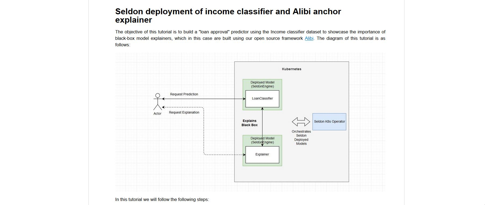


[NEXT]
<!-- .slide: data-background="images/partistat.png" class="background smallquote" style="color: white" -->

## Other OSS libraries to watch


[NEXT]
<!-- .slide: data-background="images/partistat.png" class="background smallquote" style="color: white" -->

## ELI5
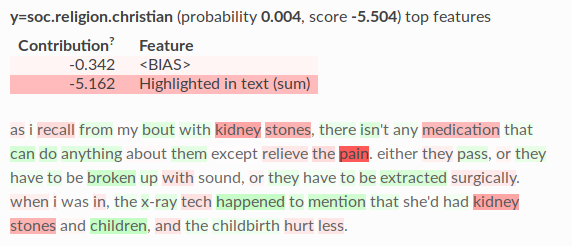

#### <a href="https://github.com/TeamHG-Memex/eli5">github.com/TeamHG-Memex/eli5</a>


[NEXT]
<!-- .slide: data-background="images/partistat.png" class="background smallquote" style="color: white" -->
## SHAP

Unifying multiple model explainability techniques

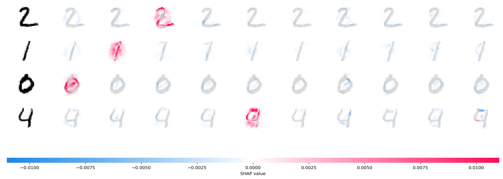
<!-- .element: style="background-color: white !important" -->

#### <a href="https://github.com/slundberg/shap">github.com/slundberg/shap</a>

[NEXT]
<!-- .slide: data-background="images/partistat.png" class="background smallquote" style="color: white" -->
## XAI
Analyse datasets, evaluate models and monitor production


#### <a href="https://github.com/ethicalml/xai">github.com/ethicalml/xai</a>


[NEXT SECTION]
<!-- .slide: data-background="images/partistat.png" class="background smallquote" style="color: white" -->
# 2.3 Reproducibility

### Model & data versioning


[NEXT]
<!-- .slide: data-background="images/partistat.png" class="background smallquote" style="color: white" -->

## Abstracting individual steps


<div style="float: left; width: 33%">
<h4>Data in </h4>

<pre><code class="code python hljs" style="font-size: 0.6em; line-height: 1em">
$ cat data-input.csv

>            Date    Open    High     Low   Close     Market Cap
> 1608 2013-04-28  135.30  135.98  132.10  134.21  1,500,520,000
> 1607 2013-04-29  134.44  147.49  134.00  144.54  1,491,160,000
> 1606 2013-04-30  144.00  146.93  134.05  139.00  1,597,780,000

</code></pre>
</div>

<div style="float: left; width: 33%">
<h4>Code / Config</h4>
<pre><code class="code python hljs" style="font-size: 0.6em; line-height: 1em">
$ cat feature-extractor.py

> def open_norm_feature_extractor(df):
>     feature = some_lib.get_open(df)
>     return feature


</code></pre>
</div>

<div style="float: left; width: 33%">
<h4>Data out</h4>
<pre><code class="code python hljs" style="font-size: 0.6em; line-height: 1em">
$ cat data-output.csv

>   Open 
>   0.57 
>   0.59 
>   0.47 

</code></pre>
</div>


[NEXT]
<!-- .slide: data-background="images/partistat.png" class="background smallquote" style="color: white" -->

<div style="position: absolute; width: 30%; right: 0; bottom: -5%">
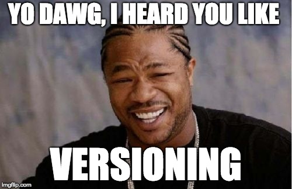
</div>
## Going one level higher

We can abstract our entire pipeline and data flows


[NEXT]
<!-- .slide: data-background="images/partistat.png" class="background smallquote" style="color: white" -->

## Hands on example using:


#### Kubeflow is a Cloud Native platform for reusable machine learning pipelines in kubernetes 


[NEXT]
<!-- .slide: data-background="images/partistat.png" class="background smallquote" style="color: white" -->

## Example

Reusable NLP Pipelines: https://bit.ly/seldon-kf-nlp

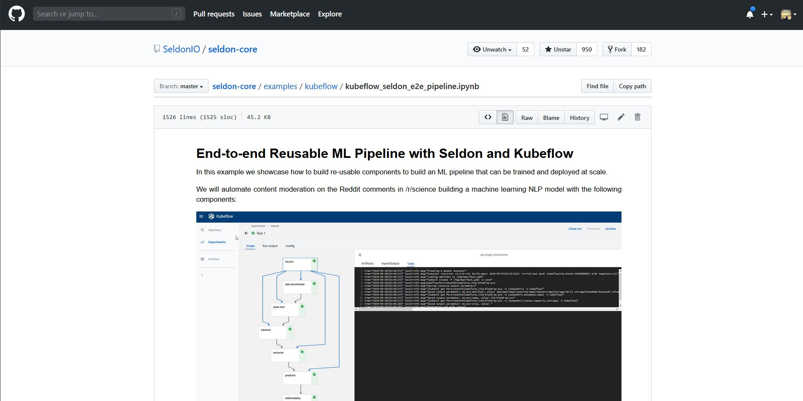


[NEXT]
<!-- .slide: data-background="images/partistat.png" class="background smallquote" style="color: white" -->

## Other OSS libraries to watch

[NEXT]
<!-- .slide: data-background="images/partistat.png" class="background smallquote" style="color: white" -->

## Data Version Control (DVC)


#### Add your data

```
dvc add images.zip
```

#### commit data input, model output and code

```
dvc run -d images.zip -o model.p ./cnn.py
```

#### Add repository location (here is s3)

```
dvc remote add myrepo s3://mybucket
```

#### Push to the location specified

```
dvc push
```

#### Check it out at <a href="https://dvc.org">dvc.org</a>

[NEXT]
<!-- .slide: data-background="images/partistat.png" class="background smallquote" style="color: white" -->

## MLFlow


#### http://github.com/databricks/mlflow


[NEXT]
<!-- .slide: data-background="images/partistat.png" class="background smallquote" style="color: white" -->

## Pachyderm 
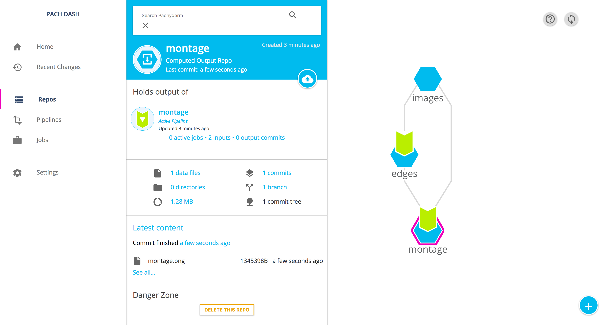

#### <a href="https://www.pachyderm.io/">www.pachyderm.io/</a>
[NEXT SECTION]
<!-- .slide: data-background="images/network-background.jpg" class="background smallest" -->

## Much more content


||||
|-|-|-|
|[🔍 Explainability](https://github.com/EthicalML/awesome-machine-learning-operations#1-explaining-black-box-models-and-datasets) |[🔏 Privacy](https://github.com/EthicalML/awesome-machine-learning-operations#2-privacy-preserving-machine-learning) | [📜 Versioning](https://github.com/EthicalML/awesome-machine-learning-operations#3-model-and-data-versioning)|
|[🏁 Orchestration](https://github.com/EthicalML/awesome-machine-learning-operations#4-model-deployment-and-orchestration-frameworks)|[🌀 FeaturEng](https://github.com/EthicalML/awesome-machine-learning-operations#5-feature-engineering-automation)|[🤖 AutoML](https://github.com/EthicalML/awesome-machine-learning-operations#6-neural-architecture-search)|
| [📓 Notebooks](https://github.com/EthicalML/awesome-machine-learning-operations#7-data-science-notebook-frameworks) | [📊 Visualisation](https://github.com/EthicalML/awesome-machine-learning-operations#8-industrial-strength-visualisation-libraries) | [🔠 NLP](https://github.com/EthicalML/awesome-machine-learning-operations#9-industrial-strength-nlp) |
| [🧵 ETL](https://github.com/EthicalML/awesome-machine-learning-operations#10-data-pipeline-etl-frameworks) | [🗞️ Storage](https://github.com/EthicalML/awesome-machine-learning-operations#11-data-storage-optimisation) | [📡 FaaS](https://github.com/EthicalML/awesome-machine-learning-operations#12-function-as-a-service-frameworks) |
| [🗺️ Computation](https://github.com/EthicalML/awesome-machine-learning-operations#13-computation-load-distribution-frameworks) | [📥 Serialisation](https://github.com/EthicalML/awesome-machine-learning-operations#14-model-serialisation-formats) | [🎁 Compiler](https://github.com/EthicalML/awesome-machine-learning-operations#15-compiler-optimisation-frameworks)  |
| [💸 CommercialML](https://github.com/EthicalML/awesome-machine-learning-operations#16-commercial-data-science-platforms) | [💰 CommercialETL](https://github.com/EthicalML/awesome-machine-learning-operations#17-commercial-etl-platforms)| |
<br>
### Check it out & add more libraries

[NEXT]
<!-- .slide: data-background="images/network-background.jpg" class="background" -->

<h2>The Institute for Ethical AI & ML</h2>

<h4>The state of Production ML in 2019</h4>

<table class="bio-table">
  <tr>
    <td style="float: left">
        <br>
        
        <br>
        <font style="font-weight: bold; color: white">Alejandro Saucedo</font>
        <br>
        Twitter: <a href="https://twitter.com/axsaucedo">@AxSaucedo</a>
    </td>
    <td style="float: left; color: white; font-size: 0.7em;">

        <br>
        Chief Scientist
        <br>
        <a style="color: cyan" href="http://e-x.io">The Institute for Ethical AI & ML</a
        <br>
        <br>
        <br>
        Engineering Director
        <br>
        <a style="color: cyan" href="#">Seldon Technologies</a>
        <br>
        <br>
        <hr>
        <br>
        Head of Solutions Eng. & Sci.
        <br>
        <a style="color: cyan" href="http://eigentech.com">Eigen Technologies</a>
        <br>
        <br>
        Software Engineer
        <br>
        <a style="color: cyan" href="#">Bloomberg LP.</a>

    </td>
  </tr>
  <tr>
  </tr>
</table>


