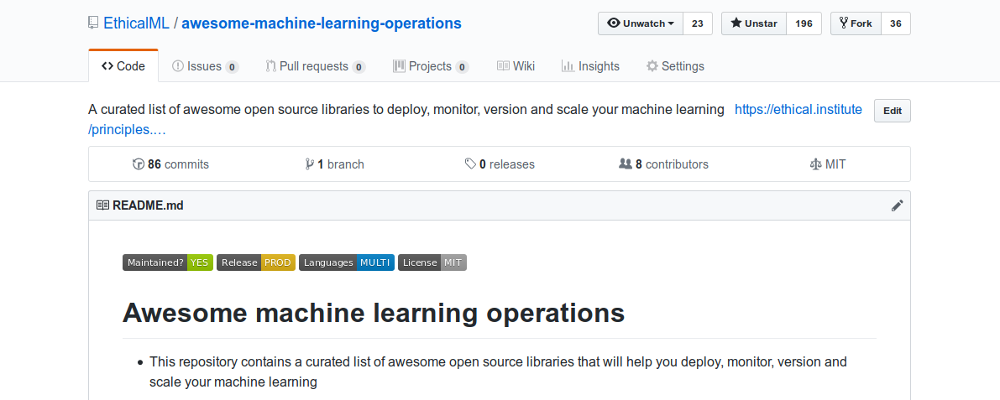
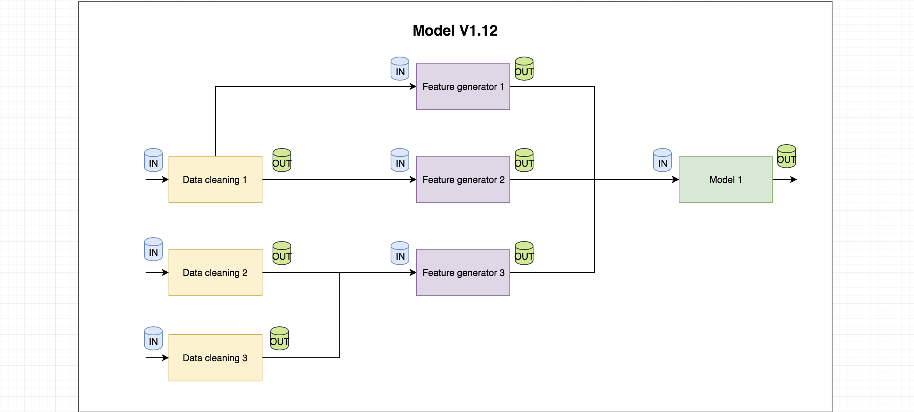
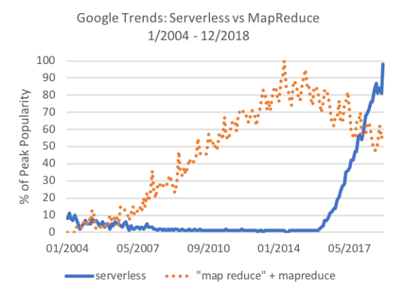
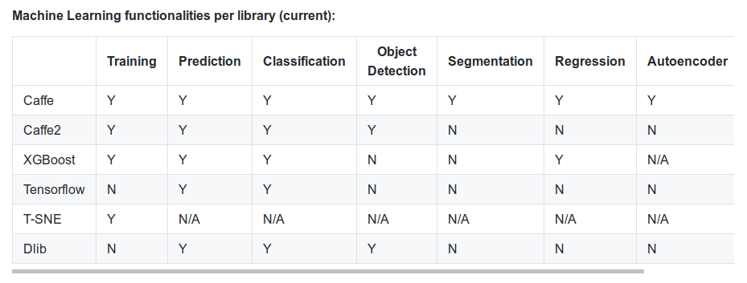

<!-- .slide: data-background="images/network-background.jpg" class="background" -->

<h2>The Institute for Ethical AI & ML</h2>
<h3>The state of MLOps in 2019</h3>
<p>
  <br />
  <br />
    Alejandro Saucedo | <a href="">a@ethical.institute</a><br/><br/>
    Twitter: <a href="http://twitter.com/AxSaucedo">@AxSaucedo</a><br/>
  <br />
</p>

[NEXT]
<!-- .slide: data-background="images/parti.png" class="background smallquote" style="color: white" -->

## Small data science projects

<!-- .element: style="background-color: white !important" -->

### Works relatively well


[NEXT]
<!-- .slide: data-background="images/parti.png" class="background smallquote" style="color: white" -->

# However
As our data science requirements grow...
## We face new issues

[NEXT]
<!-- .slide: data-background="images/parti.png" class="background smallquote" style="color: white" -->
#### Increasing complexity in flow of data


[NEXT]
<!-- .slide: data-background="images/parti.png" class="background smallquote" style="color: white" -->
#### Each data scientist has their own set of tools

<div class="left-col">
    <ul>
        <li>Some ♥ Tensorflow</li>
        <li>Some ♥ R</li>
        <li>Some ♥ Spark</li>
    </ul>
</div>
<div class="right-col">

</div>

<br style="clear:both">
### Some ♥ all of them


[NEXT]
<!-- .slide: data-background="images/parti.png" class="background smallquote" style="color: white" -->

#### Serving models becomes increasinly harder


[NEXT]
<!-- .slide: data-background="images/parti.png" class="background smallquote" style="color: white" -->
#### When stuff goes wrong it's hard to trace back


[NEXT]
<!-- .slide: data-background="images/partistat.png" class="background smallquote" style="color: white" -->

### As your technical functions grow...


[NEXT]
<!-- .slide: data-background="images/partistat.png" class="background smallquote" style="color: white" -->

### So should your infrastructure


[NEXT]
<!-- .slide: data-background="images/parti.png" class="background smallquote" style="color: white" -->
## It's challenging


[NEXT]
<!-- .slide: data-background="images/partistat.png" class="background smallquote" style="color: white" -->

<h1 style="color: white !important">Awesome <font style="color:#00ffda">ML</font>Ops</h1>
<h4>Libraries to deploy, version, monitor & scale ML</h4>

  <a style="color:#00ffda" href="https://bit.ly/awesome-mlops">bit.ly/awesome-mlops</a>
  <br />
  <br />


[NEXT]
<!-- .slide: data-background="images/partistat.png" class="background smallquote" style="color: white" -->

## Principles today
<br>

<div class="left-col" style="width: 40%; padding-top: 25px">
<ul>
    <li>Reproducibility</li>
    <li>Orchestration</li>
    <li>Explainability</li>
</ul>
</div>

<div class="right-col" style="width: 60%">

</div>

[NEXT SECTION]
<!-- .slide: data-background="images/partistat.png" class="background smallquote" style="color: white" -->
# 2.1 Reproducibility

### Model & data provenance


[NEXT]
<!-- .slide: data-background="images/partistat.png" class="background smallquote" style="color: white" -->

## Abstracting individual steps


<div style="float: left; width: 33%">
<h4>Data in </h4>

<pre><code class="code python hljs" style="font-size: 0.6em; line-height: 1em">
$ cat data-input.csv

>            Date    Open    High     Low   Close     Market Cap
> 1608 2013-04-28  135.30  135.98  132.10  134.21  1,500,520,000
> 1607 2013-04-29  134.44  147.49  134.00  144.54  1,491,160,000
> 1606 2013-04-30  144.00  146.93  134.05  139.00  1,597,780,000

</code></pre>
</div>

<div style="float: left; width: 33%">
<h4>Code / Config</h4>
<pre><code class="code python hljs" style="font-size: 0.6em; line-height: 1em">
$ cat feature-extractor.py

> def open_norm_feature_extractor(df):
>     feature = some_lib.get_open(df)
>     return feature


</code></pre>
</div>

<div style="float: left; width: 33%">
<h4>Data out</h4>
<pre><code class="code python hljs" style="font-size: 0.6em; line-height: 1em">
$ cat data-output.csv

>   Open 
>   0.57 
>   0.59 
>   0.47 

</code></pre>
</div>


[NEXT]
<!-- .slide: data-background="images/partistat.png" class="background smallquote" style="color: white" -->

<div style="position: absolute; width: 30%; right: 0; bottom: -5%">

</div>
## Going one level higher

We can abstract our entire pipeline and data flows



_note_
Similarly we can store the accuracy of the model
Together with all the parameters that were used to compute it


[NEXT]
<!-- .slide: data-background="images/partistat.png" class="background smallquote" style="color: white" -->

## Ones to watch

[NEXT]
<!-- .slide: data-background="images/partistat.png" class="background smallquote" style="color: white" -->

## Data Version Control (DVC)


#### Add your data

```
dvc add images.zip
```

#### commit data input, model output and code

```
dvc run -d images.zip -o model.p ./cnn.py
```

#### Add repository location (here is s3)

```
dvc remote add myrepo s3://mybucket
```

#### Push to the location specified

```
dvc push
```

[NEXT]
<!-- .slide: data-background="images/partistat.png" class="background smallquote" style="color: white" -->

## ModelDB

<div class="left-col">
<h4>Normal sklearn</h4>

<pre><code class="code python hljs" style="font-size: 1em; line-height: 1em">
def fit_and_predict(data):
    model.fit(data)
    preprocessor.transform(data)
    model.predict(data)

</code></pre>
</div>


<div class="right-col">
<h4>ModelDB-enabled</h4>

<pre><code class="code python hljs" style="font-size: 1em; line-height: 1em">
def fit_and_predict(data):
    model.fit_sync(data)
    preprocessor.transform_sync(data)
    model.predict_sync(data)

</code></pre>
</div>


[NEXT]
<!-- .slide: data-background="images/partistat.png" class="background smallquote" style="color: white" -->

## Pachyderm 


[NEXT SECTION]
<!-- .slide: data-background="images/partistat.png" class="background smallquote" style="color: white" -->

# 2.2 Model Orchestration


### Training & serving at scale


[NEXT]
<!-- .slide: data-background="images/partistat.png" class="background smallquote" style="color: white" -->

## Computational Resource allocation

Services with different computational requirements

With often complex computational graphs

We need to be able to allocate the right resources

<br>
### This is a hard problem


[NEXT]
<!-- .slide: data-background="images/partistat.png" class="background smallquote" style="color: white" -->

#### Usage vs Traditional Servers


[source: <a href="https://algorithmia.com/">Algorithmia</a>]

[NEXT]
<!-- .slide: data-background="images/partistat.png" class="background smallquote" style="color: white" -->

#### Usage vs Elastic Servers


[source: <a href="https://algorithmia.com/">Algorithmia</a>]

[NEXT]
<!-- .slide: data-background="images/partistat.png" class="background smallquote" style="color: white" -->

#### Usage vs Serverless


[source: <a href="https://algorithmia.com/">Algorithmia</a>]

[NEXT]
<!-- .slide: data-background="images/partistat.png" class="background smallquote" style="color: white" -->

#### Serverless vs MapReduce (Publications)



[source: Arxiv Paper - <a href="https://arxiv.org/pdf/1812.03651.pdf">Serverless: One step fwd, two back</a>]


[NEXT]
<!-- .slide: data-background="images/partistat.png" class="background smallquote" style="color: white" -->

## Ones to watch

[NEXT]
<!-- .slide: data-background="images/partistat.png" class="background smallquote" style="color: white" -->


## Seldon


[NEXT]
<!-- .slide: data-background="images/partistat.png" class="background smallquote" style="color: white" -->

## MLeap Serving

Diving one level deeper into serialization of models


[NEXT]
<!-- .slide: data-background="images/partistat.png" class="background smallquote" style="color: white" -->
## DeepDetect

Unifying multiple external machine learning libraries on a single API




[NEXT SECTION]
<!-- .slide: data-background="images/partistat.png" class="background smallquote" style="color: white" -->
# 2.3 Explainability
Tackling "black box model" situations


[NEXT]
<!-- .slide: data-background="images/partistat.png" class="background smallquote" style="color: white" -->
## Going beyond the algorithms 
Explainability through tools, process and domain expertise.


[Our talk on <a href="https://www.youtube.com/watch?v=GZpfBhQJ0H4">Explainability of Tensorflow Models</a>]


[NEXT]
<!-- .slide: data-background="images/partistat.png" class="background smallquote" style="color: white" -->

## Data assessment

<div class="left-col">
<br>
<ul>
    <li>Class imbalances</li>
    <li>Protected features</li>
    <li>Correlations</li>
    <li>Data representability</li>
</ul>
</div>
<div class="right-col">

</div>

[NEXT]
<!-- .slide: data-background="images/partistat.png" class="background smallquote" style="color: white" -->

## Model assessment

<div class="left-col">

</div>
<div class="right-col">
<br>
<ul>
    <li>Feature importance</li>
    <li>Model specific methods</li>
    <li>Domain knowledge abstraction</li>
    <li>Model metrics analysis</li>
</ul>
</div>

[NEXT]
<!-- .slide: data-background="images/partistat.png" class="background smallquote" style="color: white" -->

## Production monitoring


<div class="left-col">

</div>
<div class="right-col">
<ul>
    <li>Evaluation of metrics</li>
    <li>Manual human review</li>
    <li>Monitoring of anomalies</li>
    <li>Setting thresholds for divergence</li>
</ul>
</div>


[NEXT]
<!-- .slide: data-background="images/partistat.png" class="background smallquote" style="color: white" -->

# Ones to watch


[NEXT]
<!-- .slide: data-background="images/partistat.png" class="background smallquote" style="color: white" -->

## ELI5


[NEXT]
<!-- .slide: data-background="images/partistat.png" class="background smallquote" style="color: white" -->
## SHAP

Unifying multiple model explainability techniques


<!-- .element: style="background-color: white !important" -->

[NEXT]
<!-- .slide: data-background="images/partistat.png" class="background smallquote" style="color: white" -->
## XAI
Analyse datasets, evaluate models and monitor production


[Open source project maintained by us]

[NEXT SECTION]
<!-- .slide: data-background="images/network-background.jpg" class="background smallest" -->

## Much more content

||||
|-|-|-|
|Explainability |Privacy | Versioning|
|Orchestration|Feature Engineering|AutoML|
| Notebooks | Visualisation | NLP |
| ETL | Storage | FaaS |
| Computation | Serialisation | Compiler  |

<br>
### Check it out & add more libraries

[NEXT]
<!-- .slide: data-background="images/network-background.jpg" class="background" -->

<h2>Scalable Machine Learning</h2>
<h4>The state of DataOps / MLOps in 2018</h4>

<table class="bio-table">
  <tr>
    <td style="float: left">
        
        <br>
        <font style="font-weight: bold; color: white">Alejandro Saucedo</font>
        <br>
        <br>
    </td>
    <td style="float: left; color: white; font-size: 0.7em;">

        Head of Solutions Eng./Science
        <br>
        <a style="color: cyan" href="http://e-x.io">Eigen Technologies</a
        <br>
        <br>
        <br>
        Chairman
        <br>
        <a style="color: cyan" href="http://ethical.institute">The Institute for Ethical AI & ML</a>
        <br>
        <br>
        Member, Broader AI Expert Group
        <br>
        <a style="color: cyan" href="#">European Commission</a>
        <br>
        <br>
        Advisory group
        <br>
        <a style="color: cyan" href="http://teensinai.com">TeensInAI</a>
        <br>

    </td>
  </tr>
  <tr>
  </tr>
</table>
  


